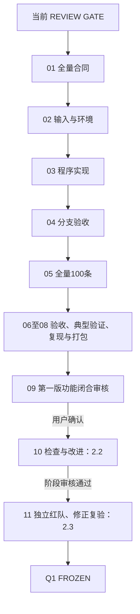

# Q1 闭合推进步骤：从 REVIEW GATE 到第一版完整交付与最终冻结

编制日期：2026-09-24。文档性质：原始推进计划与执行状态记录。原始计划编写时的基线是2.1.7 REVIEW GATE、100条正式特征尚未生产；实际进度见下方“执行状态”。

## 执行状态（截至2026-09-24）

- 步骤01–08：已完成。合同、输入与环境冻结、程序、异常分支、100条正式特征、全量验收、典型对应、迁移安装与复现、Q1候选包均已生成。
- 步骤09：作者侧闭合检查及独立P2只读验收通过。最终归档100/100审计通过；9条固定分支资源暂停后恢复并9/9通过，5条词级trace 5/5通过。详细结论见`outputs/q1/v1_delivery/reports/step09_q1_v1_closure_review.md`和`outputs/q1/v1_delivery/Q1复现闭合修复_2026-09-24/Q1第一版闭合验收报告.md`。
- 两项P1复现缺口已修复：便携依赖安装不再引用原电脑绝对路径；生成词级trace的上游脚本和官方词映射程序已纳入交付，并在迁移包中复核。
- 当前状态：Q1第一版处于独立审核门，仍保持2.1.7 REVIEW GATE；未进入2.2，也未标记Q1最终冻结。待用户决定下一阶段。
- 修复后Q1候选包大小、SHA及预算余量见`outputs/q1/v1_delivery/Q1复现闭合修复_2026-09-24/package/`下的sidecar；该值只核算Q1包，Q2/Q3尚未加入全题附件预算。

## 1. 本次要达成的结果

先完成 **Q1 第一版功能闭合**：原题要求的特征提取、实际可信粒度的时间对应、100 条特征文件、100 行结果表、典型验证和复现说明全部落地。之后，经用户确认进入 **2.2 检查与改进**，再完成 **2.3 独立红队、修正复验与冻结**。

第一版功能闭合允许如实记录特征不可用、局部词时间失败、文本与音视频无法对应等数据现象；工程缺陷、输出缺失、规则不明和没有依据的时间映射必须先解决。100 个文件存在，不能单独证明 Q1 已闭合。

依据按来源记录：

- **[题目明确]** 原题问题1，以及“结果与提交说明”中 Q1 的四项要求：整体方案、特征文件与100条汇总、至少1个典型对应验证、版本参数与完整流程。全题附件总量 ≤50 MB。
- **[官方答疑，经用户提供]** 官方文本使用标签表原文；音频使用实际音轨；画面使用实际视频；静音和无脸不等于模态不存在；错配可保留 A/V 时间对应及样本级文本，不制造词时间。答疑截图来源与本地文件哈希应在正式合同中归档。
- **[执行协议]** [Notion Q1、2.2、2.3](https://app.notion.com/p/3e3bcbf1217a8093b353fc7a76dd9b26)。最近读取所示编辑时间：2026-09-23T14:41:09.403Z。其 A0 旧合同仍写有“只处理3条”和“文本错配触发 HARD STOP”，需在全量合同中逐条标明适用范围与替代规则。
- **[数据事实]** 已发布的100条审计及三条 A0 pilot。审计发布提交：[3515744](https://github.com/hahayyf666-netizen/shuxuejianmo/commit/35157442c768d3313d7e7fa2da53c516ae6d492e)。机器 ASR 和 stable-ts 共用 Whisper base.en，不作为两套独立内容真值。
- **[用户最新要求]** 采用现有审核结果推进；不安排全量逐条听辨；先闭合第一版再进入2.2；每阶段四项汇报；阶段间未经确认不自动推进；有意义的报告和材料同步 GitHub。

## 2. 推进总表与阶段边界

下表是工作步骤编号，不改写 Notion 的章节编号。每步先达到验收条件，再按用户授权范围继续；用户若一次授权连续几步，可在该范围内执行，不重复索取同一授权。2.2 和最终冻结仍各有明确阶段入口。

| 步骤 | 工作 | 核心交付 | 进入下一步的条件 |
| --- | --- | --- | --- |
| 01 | 对照原题、答疑、审计，写正式全量合同 | 合同、字段说明、旧新条款差异表 | 对齐分支、状态、长度、mask 和授权范围明确 |
| 02 | 固定输入、环境和运行配置 | 100条输入清单、哈希、环境快照、运行配置 | 身份和资产可追溯，资源适合串行运行 |
| 03 | 实现完整程序与统一读取 | 全量入口、提取和路由模块、读取与验证器 | 所有分支有明确代码路径，接口自洽 |
| 04 | 做分支与边界样本验收 | 固定检查样本清单、特征与验收记录 | 各分支实际跑通，未解决工程错误为0 |
| 05 | 执行100条第一版特征生产 | 100个NPZ、100行manifest、逐样本日志 | 每个样本产物完整，异常均有合法表示 |
| 06 | 全量结构、时间与覆盖检查 | 自动验收报告、异常与覆盖统计 | 全量硬性验收通过，统计与文件一致 |
| 07 | 典型对应验证及方法材料 | 正常对应链、异常示例、Q1方法与结果说明 | 题目要求的对应证据可复核，结论有边界 |
| 08 | 复现检查与附件打包 | README、配置、依赖、读取示例、体积报告 | 按说明可运行，附件组织与体积合规 |
| 09 | 第一版功能闭合审核 | 第一版闭合报告、需求追踪表、GitHub材料 | 用户确认后才进入2.2 |
| 10 | 2.2 检查与改进 | 缺陷清单、必要对照实验、改进结论 | 按明确缺陷验证，完成阶段审核 |
| 11 | 2.3 独立红队与冻结 | 红队意见、处理记录、复验、冻结清单 | 独立审查和修正复验通过，确认后标记 Q1 FROZEN |

执行主线：



## 3. 步骤01：写清全量执行合同

### 3.1 先处理旧合同中的适用范围

输出逐条对照表，每条包含“旧规则、适用场景、新规则、依据、对文件及程序的影响”。至少处理：

| 旧规则或易混点 | 全量合同必须明确的内容 |
| --- | --- |
| A0只运行3条 | 原3条清单及历史结果继续作为固定证据；全量使用独立100条清单与新输出目录 |
| 官方文本不匹配即整个流程停止 | 按最新答疑作为对应异常处理；身份、共享时间轴或核心语义不明才触发计划级停止 |
| 所有样本都按官方词对齐 | 分别记录词级映射、部分词可用、A/V时间对应和样本级文本关联 |
| 所有模态第一维都等于词数 | 仅词级派生特征遵守此约束；原生音频窗、视频帧与文本序列分别记录长度 |
| audio_valid、vision_valid含义 | 保留旧pilot字段语义；新schema新增存在性、观测可用性、内容有效性和对应关系字段 |
| 程序结束或文件写出就是成功 | 区分执行完成、内容质量与对齐粒度；按schema验收后才能计入完整交付 |
| 人工复核字段 | 历史听辨记录保留真实来源；本轮按机器证据和保守输出规则处理，不设置用户逐条听辨任务 |

用户后续明确指令用于解决旧文本冲突，不能因 Notion 尚未同步而忽略这些指令。正式执行前把已经确定的规则写入版本化合同；Notion 正文的修订另有变更记录。

### 3.2 固定处理分支及判断顺序

路由先判断身份和时间轴，再判断可用信息与文本时间映射。下面是第一版拟采用的规则，步骤01结束时须写成逐项可执行条件。

| 条件 | 实际处理 | 时间对应层级 | 必须保存的证据 |
| --- | --- | --- | --- |
| 身份、原始来源或共同时间轴无法确定 | 停止依赖该语义的生产并报告影响范围 | 无法确定 | 文件身份、解码、PTS及错误记录 |
| 数字静音，或已有充分证据确认无人声 | 官方文本正常编码；原音轨照常提取声学窗；画面按PTS处理 | 有依据的A/V时间；官方词时间未知时仅样本关联 | `audio_present=1`、`audio_speech_valid=0`、真实声学值和支持区间 |
| 已有明确文本错配证据 | 保留官方文本特征及原始A/V特征；不使用强制对齐结果声称官方词时间可信 | A/V时间对应，文本仅样本级关联 | 错配证据来源、`text_av_time_mapping_status=unavailable` |
| 内容对应有依据且词时间满足合同 | 建立官方词与声学窗、视频帧的映射；正常词按center聚合 | 词级；局部失败单独记录 | 原文映射、工具时间、观测索引、各类mask |
| 机器证据不足以支持可靠词时间 | 输出完整文本和原生A/V序列，保留诊断结果 | A/V时间对应，文本样本级关联 | 机器筛查级别、不能使用词时间的具体原因 |
| 某些或全部视频帧无有效人脸输出 | 保存视频PTS与观测位置，面部特征使用明确mask | 按该样本原有时间层级 | `video_present=1`，逐帧及样本级`face_feature_valid` |

无脸是可与任一分支同时发生的状态，不能把它误当成互斥的样本类型。无有效人声也不自动意味着官方词位置已知；没有证据时，不能将整段静音平均分配给各词。

机器 close/moderate/high/empty 标记按现有审计结果保留。低概率、ASR文字相似和区间合法性均不单独升级为内容确认。第一版可以对证据不足的条目采用 A/V 独立时间序列作为可用输出，完成100条交付；不以新增人工听辨作为前置条件。若要采用新的机器词级准入规则，须在步骤01写出条件、依据和局限，不能在全量结果出现后调整阈值追求通过率。

### 3.3 明确字段语义

正式字段字典至少分为以下四组：

1. **存在性：**`text_present / audio_present / video_present`。
2. **观测和特征可用性：**`audio_observation_valid`、逐帧`face_feature_valid`、文本编码有效性。实际有声学窗，静音也可为可用观测。
3. **内容有效性：**`text_content_valid / audio_speech_valid / vision_feature_valid`，并记录各判断的范围与来源。二值证据不足可用明确的unknown状态，不能把未知改成0；画面信息与面部表示须区分。
4. **对应关系：**`audio_visual_time_valid / text_audio_correspondence / text_av_time_mapping_status`，另存词区间的结构合法性与该区间是否被用于可信映射。

数值长度必须区分：真实序列位置数、padding长度、特征有效位置数。当前第一版拟保持变长、不全局padding：每个模态的`valid_length`表示非padding位置数，内部检测失败用mask表达。不能以`mask.sum()`截断带有内部缺口的序列。静音样本的音频观测长度大于0，已确认无人声状态为0；二者同时成立。

**交付：**`合同补充说明.md`、`字段与文件规范.md`、`旧新条款差异表.md`、版本化配置草案。三份文件的状态先标“待冻结”，规则确定后记录版本与哈希。

**验收：**所有100条都有可解释的路由；每个字段有类型、范围、粒度和未知值规则；不存在要求伪造词时间或用一个总valid覆盖所有状态的条款。

## 4. 步骤02：固定输入、环境、资源和输出位置

1. 从官方标签表与原MP4构造100条唯一键清单；保存`sample_key`、相对源路径、官方原文、源文件SHA-256及标签表SHA-256。模型输入不包含情感目标标签。
2. 为当前审计、原A0清单和pilot工件建立只读基准哈希清单。后续检测旧工件是否被意外覆盖。
3. 使用现有 Python 3.12.10 CPU 环境和已冻结资产：stable-ts 2.19.1、openai-whisper 20250625、torch/torchaudio 2.8.0、Whisper base.en；RoBERTa、openSMILE、MediaPipe等版本与revision按实际已通过资格门的记录核验。
4. 保存解释器、pip freeze、模型revision及SHA、随机性设置、线程数、操作系统、输入配置和代码版本。库名相同不能代替模型文件身份核验。
5. 启动前重新测可用内存和磁盘；约4 GiB可用内存是预留余量建议，不是算法的最低内存定理。CPU逐样本处理；不同时加载100条完整媒体，也不加载Q2/Q3主PKL。每样本完成后落盘、释放临时数组和MediaPipe实例。
6. 固定超时、重试上限及退出码语义。内存不足、暂时性I/O错误和同参数重试记录为工程恢复；超时不能被改写为文本错配。剩余资源不适合继续时在样本边界保存进度并暂停计算。

**交付：**`input_manifest.csv`、`evidence_manifest.json`、`environment.json`、`requirements-lock.txt`、`model_assets.json`、`config_snapshot.json`、`resource_preflight.json`。

**验收：**输入100条无重复无缺失；源数据和模型身份可核验；新输出路径与旧pilot物理分离；运行参数固定。此前pilot单样本结束时RSS约1.7 GiB只是观测值，不能作为全量峰值保证。

## 5. 步骤03：实现程序、输出schema和读取接口

### 5.1 程序模块

| 模块 | 负责内容 | 关键检查 |
| --- | --- | --- |
| `input_registry` | 加载官方清单及证据；统一sample_key | 一一对应、原文与SHA一致 |
| `media_decode` | 应用当前edit-list规则解码音频和视频；建立唯一共享t0 | A/V不能各自归零；使用真实PTS |
| `text_encoder` | 官方原文、可逆word/subword映射、RoBERTa最后隐层聚合 | 字符跨度、词数、截断检查 |
| `audio_encoder` | 16 kHz mono、原始eGeMAPSv02 LLD与实际分析窗 | 静音正常计算；窗时间与共享坐标对应 |
| `vision_encoder` | 每样本新建MediaPipe VIDEO实例；逐帧PTS和52维输出 | 无脸mask；无邻帧补脸；实例及时关闭 |
| `alignment_router` | 根据固定证据规则选择词级或A/V分支 | 诊断时间与被采用的时间分开 |
| `word_aggregator` | 保持center规则，计算25维LLD和52维blendshape的均值、总体标准差 | 半开区间、观测索引、空集合规则 |
| `artifact_writer` | 先写临时文件，检查成功后完成单样本提交 | 避免半写文件被计入完成；保存内容哈希 |
| `feature_reader` | 统一加载不同分支并返回实际长度、时间、mask | 不自动伪造三模态共同长度 |
| `validator` | 从产物和来源证据独立核验覆盖及映射 | 验证器不能仅调用同一聚合函数证明自己正确 |

stable-ts继续使用冻结的官方文本align调用。已完成的审计结果可以复用，但必须匹配源MP4、官方文本、模型、参数和时间规则；仅文件名相同不足以复用。新分支使用新的schema版本，旧pilot保留原样。

### 5.2 建议的文件结构

每个样本一个压缩NPZ，包含公共信息、原生观测和可选词级派生结果：

| 数据组 | 建议内容 | 形状或解释 |
| --- | --- | --- |
| 身份与模式 | schema版本、sample_key、official_text、源SHA、配置SHA、路由与证据来源 | 同一原始样本唯一标识 |
| 文本 | words、字符跨度、subword映射、text_feat、文本mask | `L_text × 768` |
| 音频原生观测 | audio_lld、window_start/end/center、观测mask | `K_audio × 25`；实际支持区间 |
| 视频原生观测 | blendshape、video_pts、support_start/end、face mask | `K_video × 52`；实际帧位置 |
| 可信词级派生 | word_start/end、时间可用mask、word_audio、word_vision、观测索引 | 存在词级依据时为`L_text × 50`和`L_text × 104` |
| 长度与覆盖 | 各模态真实长度、特征有效计数、覆盖范围、gap、共同t0 | 明确单位为秒，计数单位另列 |
| 诊断信息 | 原对齐器时间及状态、零时长与映射失败统计 | 不能自动作为可信词时间 |

这里25/52是原生特征维度，50/104是词内均值与标准差拼接后的维度，manifest必须分别描述。未建立词级关系的样本不能把原生音频、视觉序列强行改成词数行。

正式schema须固定未提供词时间的表达方式，例如NaN时间加`timestamp_available=0`，而可用时间必须有限且满足区间约束。数值特征有效位置应全部有限；只有明确允许的缺失时间字段使用NaN。旧对齐器产生的零时长原始值保存在诊断字段，不能悄悄修改后称为对齐修复。

对无脸帧，可在固定52维数组中使用数值占位加mask，但必须保留其真实帧位置、PTS与不可用状态。`vision_valid_length`不能因此变成0或删除该帧。音频静音则保存提取器实际返回值，不能因无人声整体清零。

### 5.3 A/V与词的时间查询规则

对于有依据的词区间`[s,e)`，按冻结center规则查询音频分析窗及视频观测，并保存选中索引；正文解释均值、总体标准差、mask和空集合规则。没有可信词区间时，读者仍可按同一秒制坐标查询任意A/V片段，文本只关联sample_key。

第一版不要求给所有样本生成同一个922维逐词主矩阵。是否具备这种表示，由该条样本的对齐关系决定，写入schema和结果表。

**交付：**程序包、统一入口、读取示例、schema与配置、与原始数据有关的必要验证代码。

**验收：**每个路由都能写出并读取合规产物；存在性、观测可用性、人声及时间映射不混用；工具与时间语义可追溯。

## 6. 步骤04：先验收分支和技术边界

从现有审计中按技术条件选择检查样本，在运行前保存清单及证据哈希；它是新分支的检查集合，不更换原冻结pilot。

| 检查目的 | 确定性选样规则 |
| --- | --- |
| 正常词级及edit-list时间 | `-s9qJ7ATP7w$_$6`，已有“But I just kept going”内容证据 |
| 正时间区间但内容错配 | `-mJ2ud6oKI8$_$6`，防止只凭5个合法区间进入词级分支 |
| 局部零时长词 | `-s9qJ7ATP7w$_$0`，保留第4个they及其诊断记录 |
| 数字静音 | `-mJ2ud6oKI8$_$1`和`-mJ2ud6oKI8$_$2`，保留实际声学输出 |
| 全帧无面部输出 | 当前审计中face_feature_valid=0的sample_key字典序最小者 |
| 机器证据不足分支 | 剔除上面固定项后，从该分支取sample_key字典序最小者 |
| 内存、时长边界 | Stage1 duration_proxy_sec最大者，并列按sample_key |
| 文本边界 | 官方word_count_proxy最大者，并列按sample_key；实际再核验token数量 |

最终集合取并集去重，不按情感标签或运行效果挑选。固定清单后记录真实样本数。

每条实际跑完提取、路由、落盘、读取和验证，并检查：

- 官方原文完整保留；所有词都有文本位置，即使某词没有可用时间。
- 静音有真实声学窗，`audio_speech_valid=0`；对应处理不会抹掉音频观测。
- 错配不使用词级A/V映射；A/V的共同时间坐标仍可回溯。
- 无脸保留视频位置与mask；不将缺失面部输出写成缺失视频。
- 零时长词不会被删去、均分或邻词补时间；不把局部失败扩展为无依据的全样本失效。
- 断点恢复识别已完成、未完成、来源变化和配置变化；一次受控中断恢复后无重复行或半文件。
- 记录峰值内存、样本耗时和文件体积，以实际边界样本校核全量资源配置。

**交付：**`branch_check_samples.json`、检查样本NPZ、`branch_check_report.json/md`、日志与资源统计。

**验收：**每种实际存在分支有运行证据；工程错误全部处理；数据异常有正确表示。若暴露实现bug，修复后复验受影响部分；若需要改变模型或核心语义，返回合同步骤并汇报。

## 7. 步骤05：运行100条第一版生产

1. 按输入清单固定顺序逐条处理；每个样本使用独立MediaPipe实例和共享A/V时间原点。
2. 每条完成后立即写特征文件、元数据、日志和完成状态。保留stdout、stderr、退出码、耗时、内存、输入与输出哈希。
3. 暂时性工程故障按相同配置重试并保留尝试记录。重试仍失败的条目保留状态与证据，可先完成其他不受影响的条目，但不能将占位文件计为正式完成。
4. 保存manifest草表，最终从已验收的产物重建100行权威表，防止追加重复行。
5. 完成标记与文件名不能单独作为resume依据；须验证源SHA、文本SHA、配置SHA、模型身份和schema版本。
6. 完成全部样本后核对原A0清单及历史NPZ/cache的哈希，确认它们未被覆盖。

manifest至少包含：

`sample_key、source_sha256、output_file、output_sha256、modalities、original_effective_duration_sec、各模态覆盖、各模态sequence_length/valid_length、原生与词级特征维度、alignment_granularity、text_av_time_mapping_status、存在性与可用性统计、branch_reason、execution_status、quality_flags、runtime_sec`。

时长按已冻结共享时间轴的实际覆盖定义计算，不能直接照抄某个duration元数据。native_A/V、word、word_partial等粒度的精确定义在步骤01固定。

**验收：**100个唯一输入各有一个真实、可读、符合schema的产物和一行manifest。静音或错配可合法完成生产；解码、提取或文件写入失败尚未解决时，不宣称100条已完成。

## 8. 步骤06：全量自动验收

逐条验证100份产物，输出机器可读结果和简明报告：

| 验收方面 | 必须满足 |
| --- | --- |
| 身份与覆盖 | 输入、输出、manifest均为同一100个唯一键；无漏样、额外样本或错名 |
| 原文和来源 | official_text与官方表一致；MP4、文本、模型、配置可追溯 |
| 文件读取 | NPZ可在allow_pickle=False下读取；无对象数组；字段、dtype、维度符合版本化schema |
| 有效长度 | 不padding的各模态长度等于实际序列位置数；mask长度匹配；内部无效观测不被截断 |
| 数值 | 可用特征无NaN/Inf；缺失时间严格服从schema；没有依赖全零值猜测模态是否缺失 |
| 时间与映射 | 共享t0、PTS、半开词区间、音频窗支持区间可核验；合法词满足s<e及覆盖约束 |
| 分支语义 | 错配分支不声称词级对应；静音仍有声学观测；无脸不等于video_present=0 |
| 聚合 | 对所存底层索引独立重算center归属、均值、总体标准差，与派生特征比较 |
| 统计 | 各模式、各异常、词失败数、观测覆盖统计与逐条文件一致；不能将互相重叠的质量标记相加当作样本总数 |
| 旧工件保护 | 原3条pilot及清单的哈希与步骤02基准一致 |

数值比较容差在运行前写入配置；离散标识、mask、索引与规则必须一致，浮点差异按固定容差报告。文件SHA用于身份校验；重跑数值复现比较数组内容与关键元数据，不因压缩封装时间字段不同而误判数值结果不同。

**交付：**`validation_report.json`、`validation_report.md`、`results_100.csv`、`summary.json`、异常明细。

**验收：**硬性项目全部通过；有数据异常的样本被正确计数并保留。结构检查通过仅能支持结构结论，不能转述为所有官方词均被正确说出或词边界达到毫秒精度。

## 9. 步骤07：典型对应验证和论文所需材料

先按固定技术规则选一条已有内容对应证据、可展示词级映射的样本。为其生成：官方文本片段、词区间表、音频波形与时间区间、带真实PTS的视频帧、底层观测索引、三类特征切片及mask。每项展示都从正式NPZ和源MP4读取，不为画图另造时间边界。

再给出三类异常说明：

- 静音：展示实际声学输出与`audio_speech_valid=0`同时成立。
- 文本错配：展示官方文本被保留，A/V共用时间轴，官方词时间不可用。
- 无脸及局部词时间异常：展示原始位置仍在，以及相应特征mask/映射状态。

典型正常样本满足原题至少1例的要求；异常示例说明方法如何保留实际数据。没有可靠参考词边界时，不报告“边界误差均值”“对齐准确率”等需要时间真值的指标；将时间结构、内容依据和精确边界真值分别表述。

形成可用于正文的Q1材料：输入与符号、共享时间定义、三类特征的含义与提取方法、center聚合公式、各分支的时间关系、有效长度与mask定义、100条结果表、典型验证、资源与局限。说明预训练表示及面部系数与情感线索的关系，不声称已经训练或验证了Q1情感分类性能。

**交付：**`典型对应验证.md`及配图、示例数据，`Q1方法与结果说明.md`，正文用的100条汇总。

**验收：**展示可回溯到原始素材和最终特征；文字、表格、图中的编号、时间和维度一致；主要结论有可指认的证据。

## 10. 步骤08：复现入口与附件体积

### 10.1 统一运行接口

下面是拟实现的命令接口，当前尚未实现，不能当成已成功执行的命令。交付时由实际`--help`和运行日志确认。

```text
python run_q1.py --config config/q1_v1.yaml --mode preflight
python run_q1.py --config config/q1_v1.yaml --mode branch-check
python run_q1.py --config config/q1_v1.yaml --mode full --resume
python validate_q1.py --config config/q1_v1.yaml
python make_q1_examples.py --config config/q1_v1.yaml
python package_q1.py --config config/q1_v1.yaml
```

README写明：输入附件位置及目录组织、指定解释器、锁定依赖、模型资产取得方式及SHA、运行顺序、预期100条产物、如何读取、如何续跑、如何验证。避免依赖当前终端的隐含环境变量或特定用户名路径。

在独立新进程与新输出目录，按README重跑覆盖各分支及最长样本的固定集合，比较结果和mask；同时对正式100份文件全量读取验收。这支持已测范围的复现结论。若报告“100条完整重跑复现通过”，必须实际完成100条第二次重跑，不能用少量样本替代该声明。

### 10.2 分开保存实验材料和提交材料

- 本地工作区保留原生特征、完整日志和实验cache。
- 比赛包保存100个正式NPZ及所需索引、结果表、程序、配置、依赖、说明和必要图表。原始音视频可由官方附件提供，预训练大权重按固定来源及SHA取得；不要将这些重复打入小型提交包。
- 若正式NPZ已经保存原生LLD/blendshape，比赛包不再重复放一套同内容cache。实验材料仍保留。
- 既有约7 MB估算只覆盖词级主特征；本计划包含原生观测和映射信息，须重新计算并实测，不能沿用旧估算作为附件大小结论。
- 实测压缩包字节数，同时报告MB与MiB。以50,000,000 bytes作为保守的全题50 MB核验口径，并单列Q1占用和留给Q2/Q3的空间；Q1包小于50 MB不能推出全题已符合上限。
- 去重和压缩不能损失100条覆盖或必要时序映射。确需变更dtype、删字段或改变表示，返回合同评审，不为凑体积静默改变特征。
- 提交版本采用相对路径，按题目要求检查参赛单位、姓名和队伍编号等身份信息；本地完整溯源日志可另存。

**交付：**`README.md`、依赖锁定、配置、资产清单、统一读取示例、`reproduction_check.json`、`package_manifest.json`、`size_report.json`和Q1附件候选包。

**验收：**README命令与程序一致；文件从干净进程可读取；复现声明不超出实际测试；实际体积及全题剩余预算明确。

## 11. 步骤09：提交第一版功能闭合审核

按原题逐项倒查，生成需求追踪表：

| 原题要求 | 对应交付 | 通过依据 |
| --- | --- | --- |
| 文本、语音、视觉特征定义与方法 | 合同、代码、方法说明 | 公式、维度、工具参数与实际输出一致 |
| 跨模态时序规则与实现逻辑 | schema、时间映射、分支规则 | 共享PTS、真实支持区间、可信粒度和不可用状态可复核 |
| 样本覆盖与一一对应 | 100个NPZ、100行manifest | 全量身份与覆盖检查通过 |
| 有效长度、padding与原始素材关系 | 各模态长度、mask、索引与读取接口 | 全量结构和映射检查通过 |
| 100条结果汇总 | results_100.csv及正文表格 | 与NPZ和manifest逐行一致 |
| 至少1个典型对应验证 | 典型正常对应链及异常示例 | 所有展示可回溯 |
| 版本、参数、日志和复现说明 | 环境、配置、资产清单、README、复现记录 | 实际运行范围与声明一致 |
| 提交组织与体积约束 | 候选包与size_report | 实际字节核验，并计入全题预算 |

闭合报告明确写出：哪些功能已经实现、哪些数据局限被保留、哪些算法缺陷留给2.2。只有上表全部具备实际交付和验收依据，才报告“Q1第一版功能闭合”。此时停在阶段审核点，用户确认后进入2.2。

## 12. 步骤10：2.2 检查与改进

以第一版的真实缺陷建立清单，每项固定为“缺陷 → 改进方法 → 为什么可能解决 → 如何验证 → 结果 → 是否保留”。不要求为了改进而更换组件。

候选顺序沿用已有协议：

1. 对明确的跨词窗、短词覆盖问题，先使用已有底层cache比较center与overlap；其他组件固定。
2. 对实际仍阻碍可靠词级处理的对齐缺陷，再论证是否比较MFA等候选。文本本身错配不能单靠换对齐器解决。
3. 对面部表示覆盖或身份连续性确有问题的情况，再论证视觉候选或补充表示。无脸不应被解释成整段视觉信息无效。
4. 只有证据表明gap内容需要进入最终表示时，再评估相应处理。

改进必须有公平比较，保留第一版结果，记录收益、代价和未解决问题。结构可用率上升不能直接称为对齐准确率上升。通过阶段审核后，才进入最终冻结审查。

## 13. 步骤11：2.3 独立红队、修正复验和冻结

将原题、官方答疑依据、方案、代码、100条结果、典型证据及局限提供给未参与当前实现的独立审查者。重点审查题意覆盖、素材身份、特征定义、时间单位、分支合理性、数据泄漏、验证是否支持结论、附件体积与复现。

意见按“致命、重要、可优化”分类；逐条核验并记录接受、修改或有依据不采纳的理由。对修改影响的合同、样本、特征和统计重新生成并复验；可优化项记录处理决定。致命和重要问题未闭合时不能冻结。

最终冻结记录包括：方案与schema版本、代码提交、100个输出哈希、配置及资产哈希、最终报告、独立审查记录、复验结论和附件体积。完成协议审核后标记`Q1 FROZEN`。

## 14. 停止与恢复规则

| 情况 | 执行动作 |
| --- | --- |
| 原始样本身份、数据来源、A/V共同时间轴不能可靠确定 | 计划级HARD STOP，保留证据及影响范围 |
| 继续必须修改官方数据、工具身份或尚未批准的核心时间/特征语义 | 停止受影响执行，提交合同变更及依据 |
| 暂时性内存、I/O、依赖加载或文件写入问题，语义明确 | 记录RECOVERABLE，按冻结配置恢复；不能改写成样本内容异常 |
| 已被合同覆盖的静音、错配、无脸、局部词失败 | 按分支保留数据和状态；不自动触发全计划停止 |
| 某条样本提取仍失败 | 保留失败记录，可继续不受影响样本；该失败必须解决后才能宣称100条交付完成 |
| 到达约定阶段审核点 | 提交四项汇报，按用户确认决定下一阶段 |

## 15. 本地组织与GitHub同步

本地拟采用以下目录。`v1_delivery`及其程序文件是计划产物，当前不意味着已存在：

```text
outputs/q1/
├── Q1闭合推进步骤.md
├── pilot/                              原3条冻结证据
├── diagnostics/                        已完成的审计和诊断
├── v1_delivery/
│   ├── contract/                       合同、字段字典、差异表
│   ├── code/                           正式入口、模块与验证程序
│   ├── config/                         运行配置与固定检查样本
│   ├── features/                       100个正式NPZ
│   ├── manifest.csv
│   ├── results_100.csv
│   ├── logs/
│   ├── validation/
│   ├── examples/
│   ├── reports/
│   └── submission/                     精简提交包与体积报告
└── 后续2.2和2.3各自独立的版本目录
```

中间开发脚本、临时文件和模型下载置于`work/`。正式交付仅整理到`outputs/`。

GitHub继续使用仓库根目录`阶段2.1.7_A0_Pilot/`：本计划放入`Q1闭合推进计划_2026-09-24/`；第一版各有意义的审核和结果按日期及内容建子目录。真正进入2.2、2.3时各建对应阶段目录。

每次上传先生成文件清单与哈希，只同步该次有意义的产物；提交后读取远端核对。报告所需的证据文件必须随本次材料同步或给出可访问的固定链接，不能把仅本地存在的证据描述为GitHub已提供。完整运行依赖和大模型资产按来源及哈希引用，不重复上传。

## 16. 每一步的固定回执

```text
① 完成了什么：实际执行步骤、样本范围、生成文件和GitHub提交。
② 得到什么结论：有证据支持的功能、结构、时间或质量结论。
③ 还有什么未确认：程序问题、数据局限、尚未进行的验证分别列出。
④ 是否满足下一阶段条件：逐项对应验收条件；说明下一步范围与审核状态。
```

原计划编写时的下一项工作是步骤01；截至本记录更新时，步骤01–08完成，步骤09作者侧检查与独立P2只读验收通过。当前仍停在2.1.7 REVIEW GATE，不自动进入2.2；阶段执行结论见`outputs/q1/v1_delivery/reports/step09_q1_v1_closure_review.md`。

